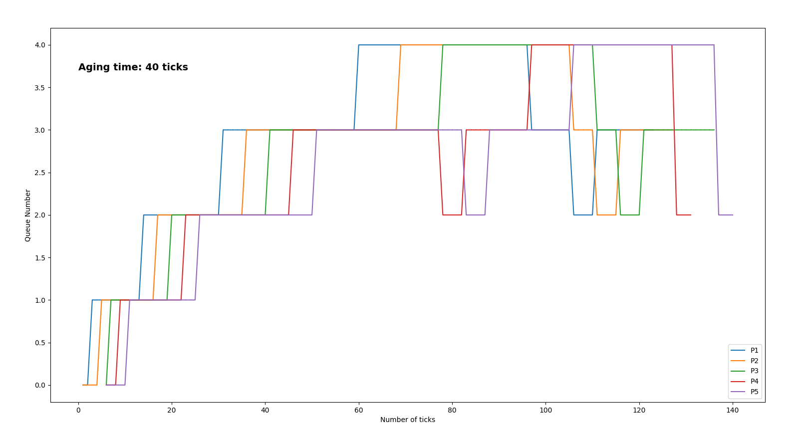

# Enhancing xv6 OS

### Implementation

* Three system calls are made. They are `waitx(int *wtime, int *rtime)`, `set_priority(int new_priority, int pid)` and `print_pinfo(void)`.
Each of these are described in *proc.c*.
* To add a system call in the OS, some amount of code was added to
    * *syscall.c*
    * *syscall.h*
    * *sysproc.c*
    * *user.h* 
    * *usys.S*
    * *defs.h*
* Each type of Scheduler is described in *proc.c*. These are present in `void scheduler(void);` function.
* Some changes have been made in *trap.c* to calculate the run time ticks and managing the rescheduling of CPU in MLFQ.

## Comparison between various schedulers

A total for 4 processes were created and tested under 4 different schedulers. 
The following results were obtained. The processes complete (exited) in this order. The following records are taken 
in presence of 1 CPU.

***First Come First Serve (FCFS)***

| Process     | Runtime       | Wait-time  |
| ------------- |:-------------:| ----------:|
| P1    | 53 | 0      |
| P2      | 48      |    54    |
| P3 | 48     |    103    |
| P4 | 48    |    151      |

***Round Robin (RR)***

Each process has a time quanta of 1 tick.

| Process     | Runtime       | Wait-time  |
| ------------- |:-------------:| ----------:|
| P1    | 54 | 0      |
| P2      | 54      |    1    |
| P3 | 55      |    2    |
| P4 | 54     |    3     |

***Priority Based Scheduling (PBS)***

The Basic priority rules were:

Priority(P1) = Priority(P2) \
Priority(P3) = Priority(P4) \
Priority(P1) > Priority(P3)

This is done using the `set_priority` system call

| Process     | Runtime       | Wait-time  |
| ------------- |:-------------:| ----------:|
| P1    | 52 | 0      |
| P2      | 52      |    1    |
| P3 | 51      |    104    |
| P4 | 51     |    105     |

***Multi-level Feedback Queue (MLFQ)***

Since waiting time for process moving between queue is difficult to obtain, the following table represents the
respective run time and waiting time for each process (R / W) after the completion of one process. Refer to graph below
for better results.

|     | P1 (R / W)      | P2 (R / W)      | P3 (R / W)      | P4 (R / W)       |
| ------------- |:-------------:| -------------:| -------------:| -------------:|
| P1    | 48 / 0 | 28 / 30     | 28 / 21 |  28 / 12 |
| P2      | -      |   49 / 0    | 37 / 13 |  37 / 4 |
| P3 | -      |    -    | 49 / 0 |  37 / 16 |
| P4 | -     |    -     | - |  48 / 0 |

FCFS offers a lower runtime since it is preemption free, although the latter process suffers from a higher waiting time, leaving them with a high response time.
In RR, each process is given only a specific amount of time to execute in CPU. The waiting time for each process is the lowest.
In PBS, the first two processes having the same priority follow a round-robin fashion, making them highly responsive. Due to higher priority, the rest two processes suffer high waiting times.  In MLFQ, aging is implemented to prevent starvation, making the waiting time for the process less than FCFS but still more remarkable than the Round-Robin Scheme. Also, CPU spent a decent amount of time deciding which process to schedule next, managing queues, promoting and demoting processes in respective queues, etc.

*Note*:  The resetting of waiting time to zero in MLFQ whenever a process goes for I/O is exploited by the programmer to maintain a desirable
         process in higher priority queues. After completion of I/O, the process returns to the same queue. Therefore, a very short I/O time is given to the programmers' desirable process before the time slice during CPU execution. It returns in the same queue with reset waiting time and repeating this procedure until completion. In this way, the process remains in the highest priority queue.

## Graph Plotting in case of MLFQ

